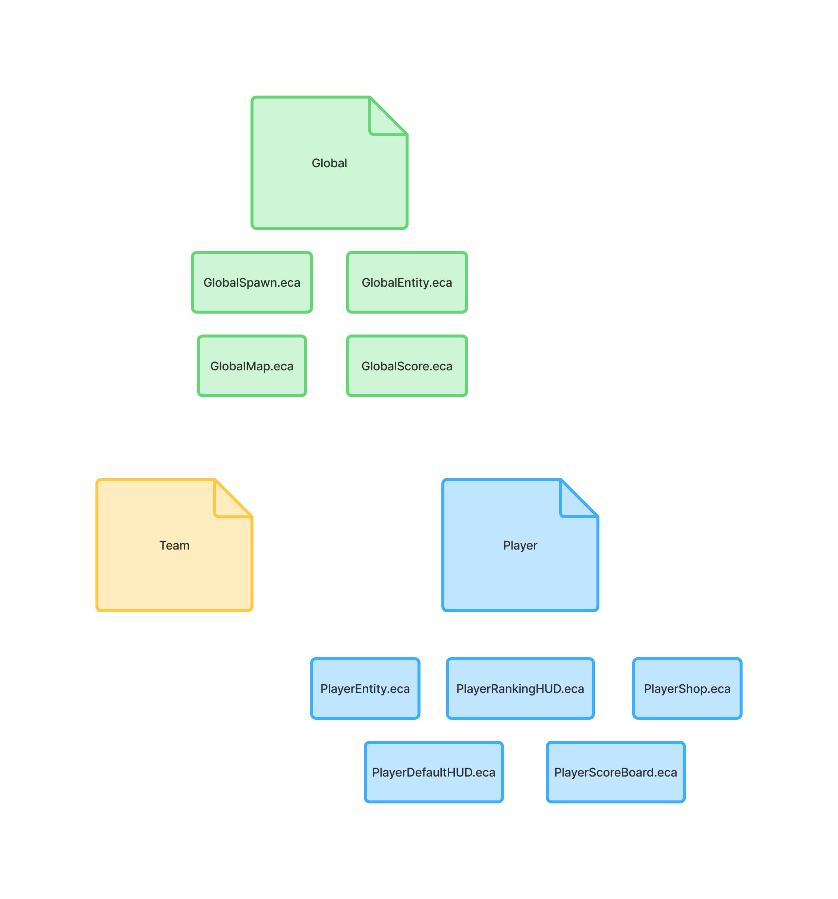

# Free For All Template

## Project Structure

## Setup

### [Setting up the project](./docs/Setup/setup.md)

## Logic 

### [1. Game Rules and Win Condition](./docs/Logic/game_rules.md)

### [2. Rotate Between Maps](./docs/Logic/map_rotate.md)

### [3. Player Respawn Logic](./docs/Logic/player_respawn.md)

### [4. Shop Config](./docs/Logic/shop_config.md)

### [5. UI](./docs/Logic/ui.md)

## Publish

### [Publish Project](./docs/Publish/publish.md)

