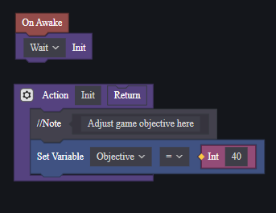
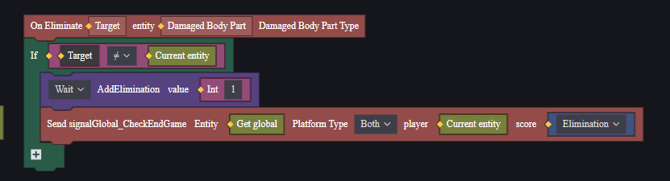
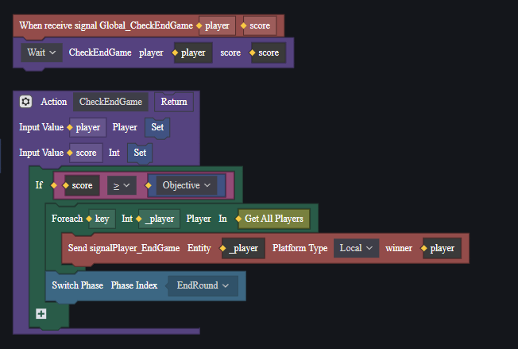

and teleport player to that spawn[<- Back](../README.md)
- [Customize Win Condition](#customize-win-condition)
- [Developing Tutorial](#developing-tutorial)
  - [Player Entity](#player-entity)
  - [Global Entity](#global-entity)

# Customize Win Condition
Open ***GlobalEntity.eca***

Adjust the match objective by changing the **Objective** parameter to your desire.

For example: If creator want to create a map that first player to reach 40 elimination win, creator can adjust it to 40.

# Developing Tutorial
## Player Entity
Create **PlayerEntity.eca** and add script to **Player**

We need to track player's elimination by increase the point when ever the Event **On Eliminate** trigger. At the same time, we dispatch a **Global_CheckEndGame** (custom event) to Global entity.

## Global Entity
Create **GlobalEntity.eca** and add script to **Global**

When receiving **Global_CheckEndGame** event, we check if the score is larger than the objective, we switch to the **EndRound** phase, if not, nothing happens.

[<- Back](../README.md)