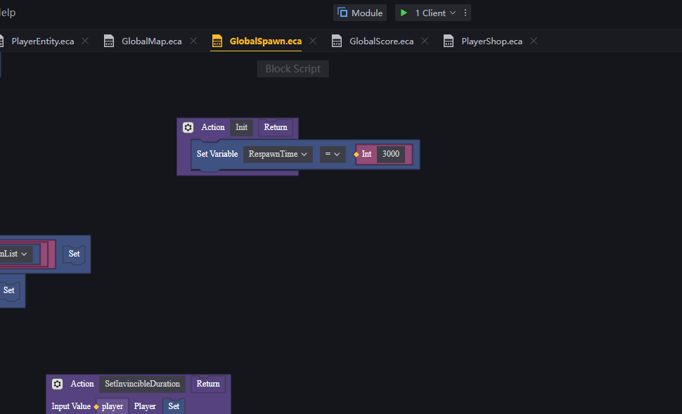
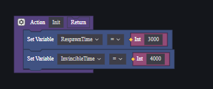
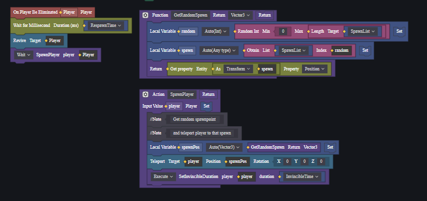

[<- Back](../README.md)
- [Customize Player Respawn Time](#customize-player-respawn-time)
- [Customize Player Invincible Time](#customize-player-invincible-time)
- [Developing Tutorial](#developing-tutorial)

# Customize Player Respawn Time
Open *GlobalSpawn.eca*

In the **Init** function, change the **RespawnTime** to the duration you want player to wait after being eliminated. For example, if creator want player to wait 3 seconds after respawn, set it to 3000 (miliseconds)

# Customize Player Invincible Time
Open *GlobalSpawn.eca*

In the **Init** function, change the **InvincibleTime** to the duration you want player to be invincible after revived. For example, if creator want player to be invincible for 4 seconds after respawn, set it to 4000 (miliseconds)

# Developing Tutorial
When the map is selected, we need to store the spawnpoint list as a varible.

Create a **GetRandomSpawn** function to get a random spawnpoint from the stored spawnpoint list.

Create a **SpawnPlayer** function to use when ever player is eliminated.

Call the **SpawnPlayer** function when player is eliminated.

