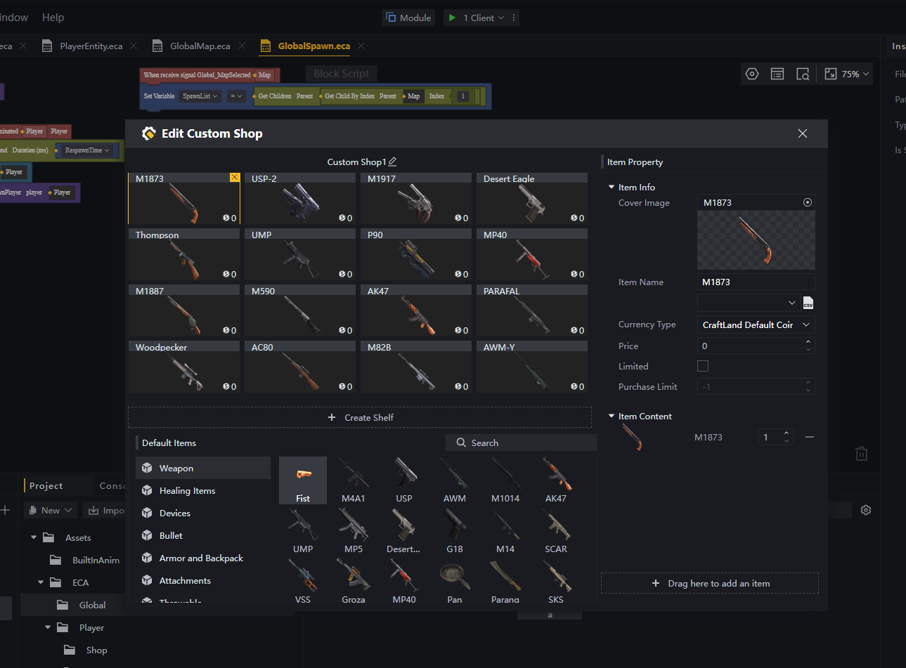
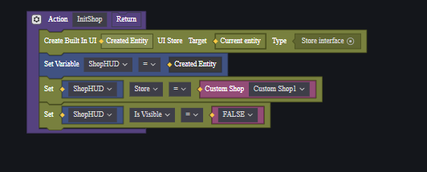
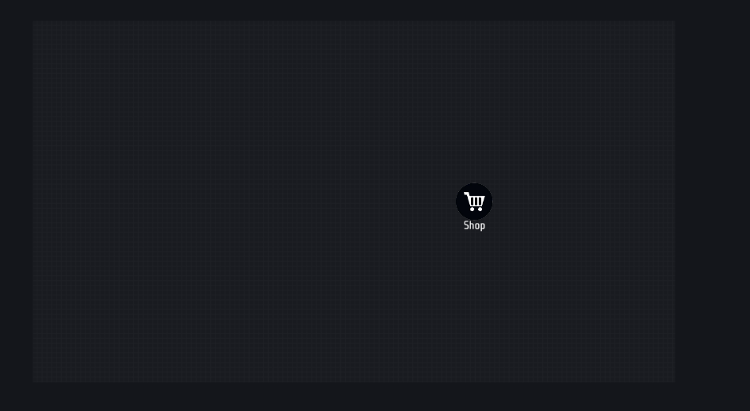
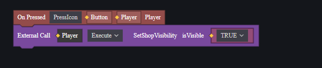
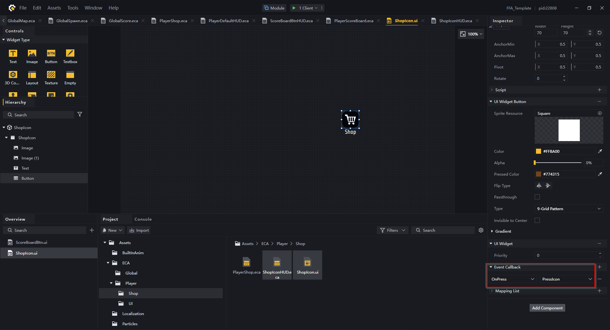

[<- Back](../README.md)
- [Shop Config](#shop-config)
- [Developing Tutorial](#developing-tutorial)
  - [Create Shop UI](#create-shop-ui)
  - [Create Shop Icon UI](#create-shop-icon-ui)

# Shop Config
Open *Module* -> *Economy* -> *CustomShop* -> *Edit*

Creator can adjust the shop by adding new guns or remove existing ones.

# Developing Tutorial

## Create Shop UI
Create *PlayerShop.eca*

Init the Shop UI by using Built In UI. Bind the shop you have created in Module -> Economy.

## Create Shop Icon UI
We need an Icon to open the shop.

Create *ShopIcon.ui*

Create *ShopIconHUD.eca* and attach to *ShopIcon.ui*

Create a callback function, execute open shop UI whenever player click it. Bind it to the button

[<- Back](../README.md)