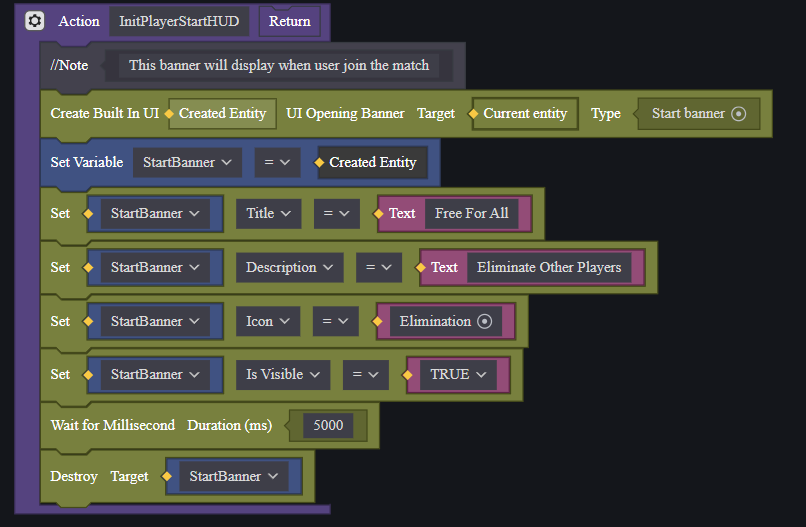

[<- Back](../README.md)
- [Player Default HUD](#player-default-hud)
  - [Customize Start Banner Information](#customize-start-banner-information)
- [Developing Tutorial](#developing-tutorial)
  - [Timer HUD](#timer-hud)
  - [Objective HUD](#objective-hud)
  - [PlayerStart HUD](#playerstart-hud)
  - [Initialize the HUD](#initialize-the-hud)
  - [Player Scoreboard](#player-scoreboard)
    - [Player Scoreboard](#player-scoreboard-1)
    - [Player Scoreboard Button](#player-scoreboard-button)
  - [Player Result HUD](#player-result-hud)
  - [Player Ranking HUD](#player-ranking-hud)
    - [Ranking UI](#ranking-ui)
    - [Ranking HUD Logic](#ranking-hud-logic)

# Player Default HUD
## Customize Start Banner Information
Open **PlayerDefaultHUD.eca**

In the **InitPlayerStartHUD** function, Creator can adjust **Title**, **Description** and **Icon** of the map.

# Developing Tutorial
Create **PlayerDefaultHUD.eca** attach it to **Player** entity in Module.

## Timer HUD

Each time phase start, call **DisplayTimer** function to display the countdown for that phase.

## Objective HUD

## PlayerStart HUD

## Initialize the HUD
Calling **Init** with the **On Awake** event will initialize the HUD when match start.

## Player Scoreboard

### Player Scoreboard

Create **PlayerScoreBoard.eca** attach it to **Player** entity in Module.

First, we need to initialize the scoreboard.

To update the scoreboard, we need to create a sort function to get the player list sorted by score. This function will return *Player List sorted by score, score list, rank list, and List of Player List sorted by score (this is the format use for updating the scoreboard)*

Update scoreboard when player is eliminated.

### Player Scoreboard Button
Create **ScoreBoardBtn.ui** and **ScoreBoardBtnHUD.eca**. Attach **ScoreBoardBtnHUD.eca** to **ScoreBoardBtn.ui**

Create a Button in the **ScoreBoardBtn.ui** file, place it where you want the player to click to open the scoreboard. In this case, we want it to be at the timer position.

In **ScoreBoardBtnHUD.eca**, create a callback function to display the scoreboard whenever the button is pressed. Then, attach the callback function to the created button above.

## Player Result HUD

Open **PlayerScoreBoard.eca**

Create a DisplayResultScoreBoard function and set the parameters. Call it when Phase **End** start.

## Player Ranking HUD

### Ranking UI

Create **Ranking.ui** file as bellow.

### Ranking HUD Logic

Create **PlayerRankingHUD.eca** file. Attach it to **Player** module.

Create **Init** and **Update** function.

Update required current player's score, objective, and current player's ranking. In this case, player score is player Elimination.
To get player ranking, can use the logic bellow.

Call Update whenever a player is eliminated. Overall, the file should look like this.

