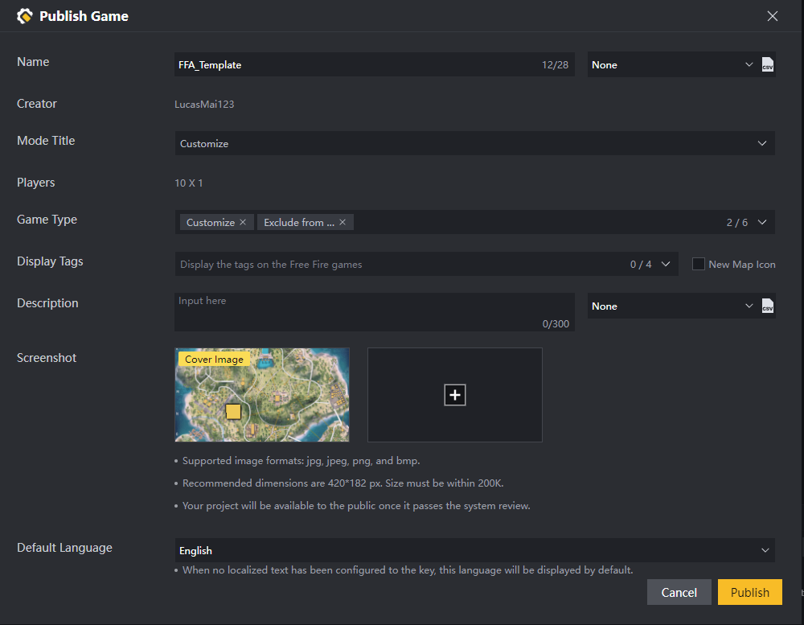
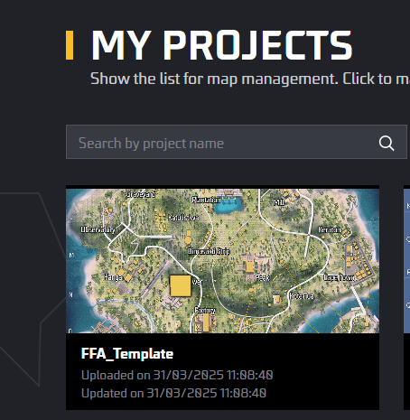
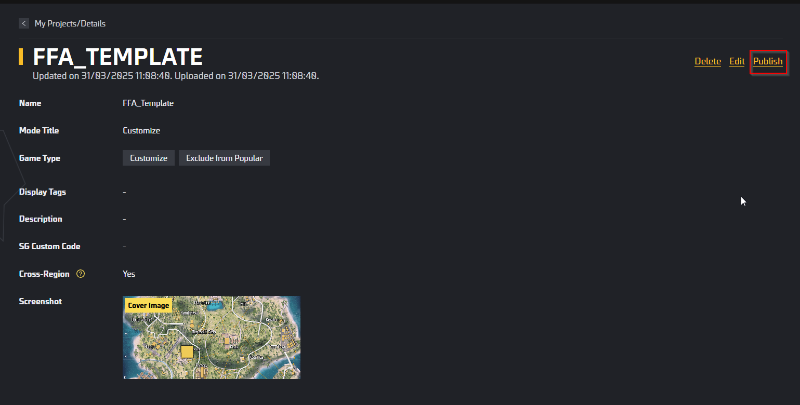
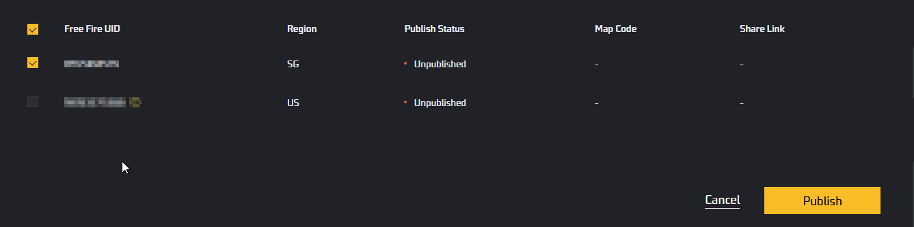

[<- Back](../README.md)
- [Publish Your Project](#publish-your-project)

# Publish Your Project
Go to **File** -> **Publish Now** or Press **ALT+P**

You can customize game name, description, etc here.

Once click publish, you will be directed to the **Craftland Creator Center**, where you can see your published project. Find the project you want to publish to live server and click on it.

Choose the account you want to publish your game with, and click Publish.

And Done. **Congratulations**, you have successfully published your game!

[<- Back](../README.md)