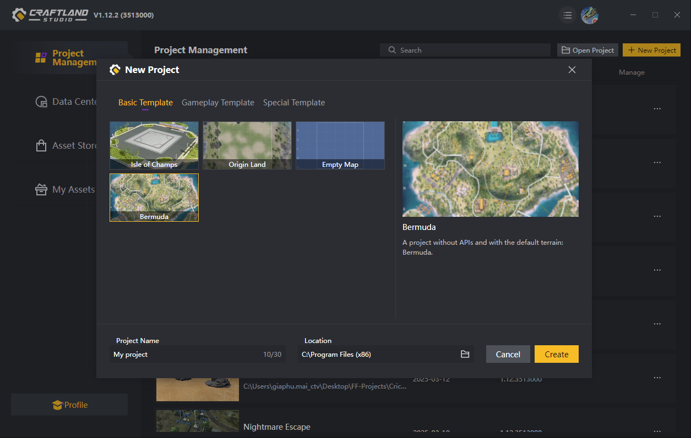
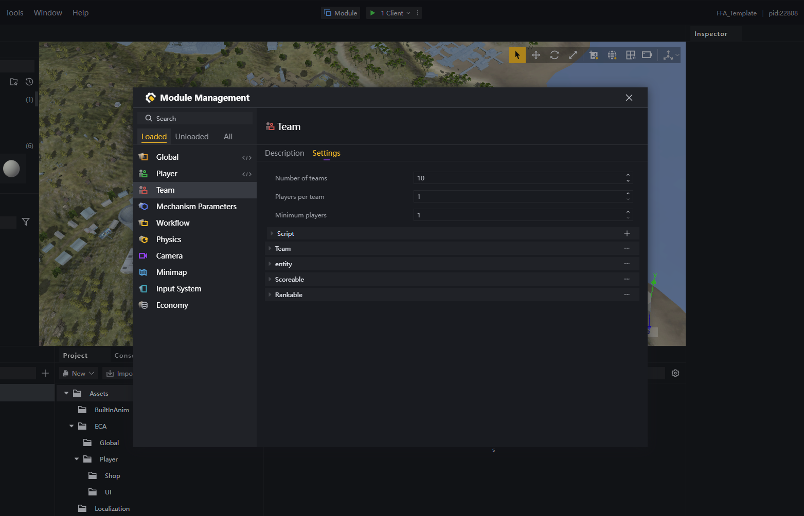
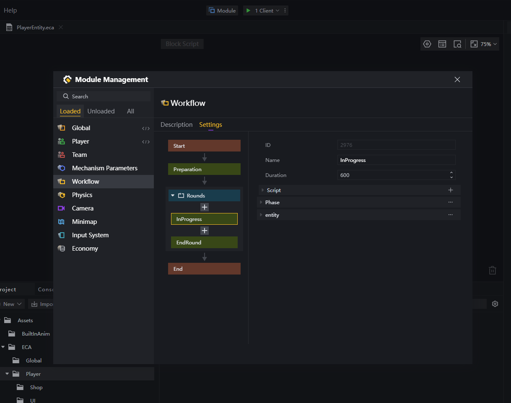
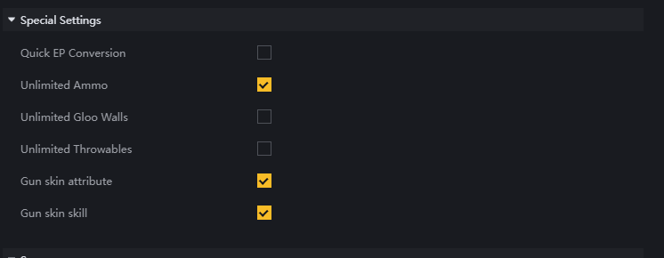
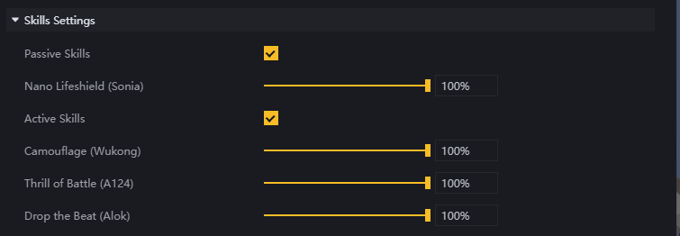

[<- Back](../README.md)
- [Create map](#create-map)
- [Number of Players Config](#number-of-players-config)
- [Workflow](#workflow)
- [Other config](#other-config)

# Create map
*Create new project*

Choose a map to create your project on. In this case, we will use Bermuda.

# Number of Players Config
Open *Module* -> *Team*

For **Free For All** mode, we want each player in a different team, so the **Player per team** here is 1.

If we want this mode to have 10 players, adjust the **Number of teams** to 10.

# Workflow
Open *Module* -> *Workflow*
Can adjust the match duration by changing duration in **InProgress** phase.

For example, if creator want the match to be **10** minutes long, can adjust to **600** seconds.

# Other config
Open *Module* -> *Mechanism Parameters*

In this part, creators can config properties of the match. For example, turn on **Unlimited Ammo** or **Unlimited Gloowall**

Or turn on/off **Active/Passive Skills**

[<- Back](../README.md)
